## Anggota Kelompok
| No | Nama                       | NRP         |   
|----|----------------------------|-------------|
| 1  | Aditya Reza Daffansyah     | 5027241034  | 
| 2  | I Gede Bagus Saka Sinatrya |	5027241088  | 

# Laporan Resmi Praktikum Jarkom

## Walkthrough Pengerjaan Praktikum Jarkom Modul 5
## Daftar Isi

- [Anggota Kelompok](#anggota-kelompok)
- [Daftar Isi](#daftar-isi)
- [Misi 1](#misi-1)
- [Misi 2](#misi-2)
- [Misi 3](#misi-3)

### Misi 1
#### 1. Identifikasi Perangkat
- **Narya: Berfungsi sebagai DNS Server.**
- **Vilya: Berfungsi sebagai DHCP Server.**
- **Web Servers: Palantir  dan IronHills.**
- **Client (Pasukan):**
    * Khamul: 5 host (Target/Burnice).
    * Cirdan: 20 host (Lycaon).
    * Isildur: 30 host (Policeboo).
    * Durin: 50 host (Caesar).
    * Gilgalad: 100 host (Ellen).
    * Elendil: 200 host (Jane).

Gambar Topologi
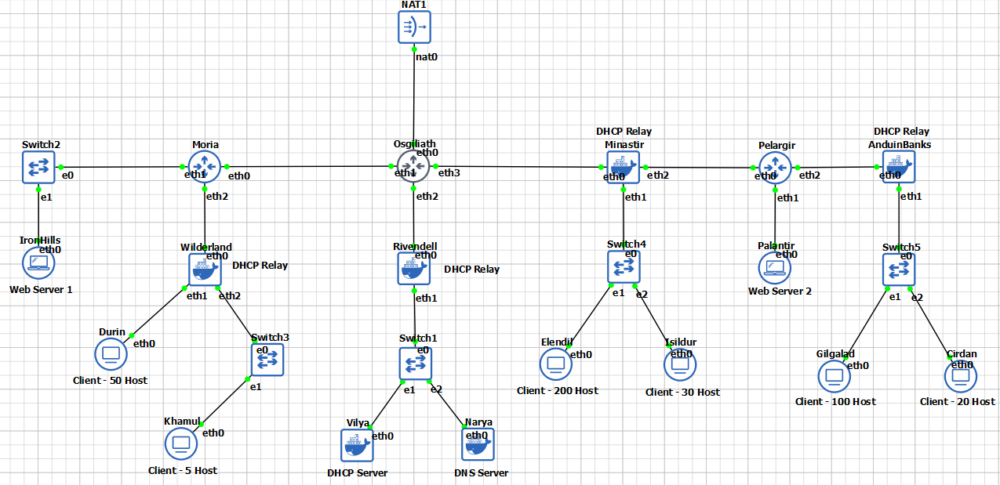

#### 2. VLSM (Pohon Subnet)
Gambar topologi setelah dilakukan pembagian subnet dengan VLSM.
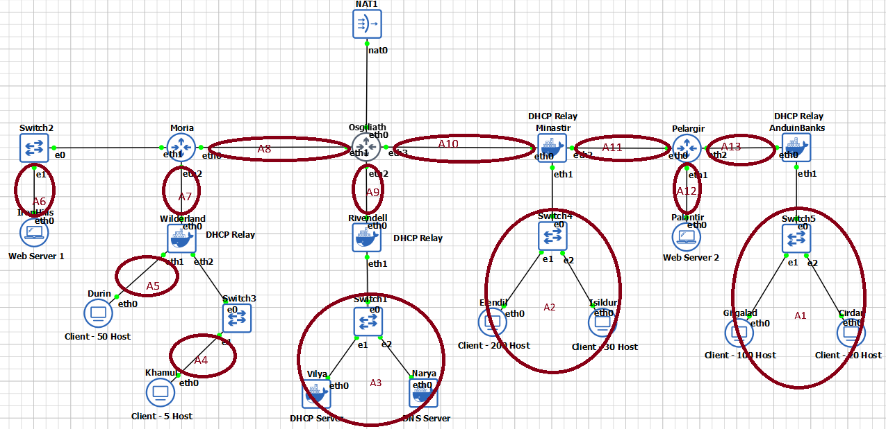

Dari data subnet yang telah kita gabungkan pada topologi di atas kita mendapat bahwa terdapat 13 kelompok, dan dibawah ini adalah pembagian IP berdasarkan pengelompokkan subnet di atas.
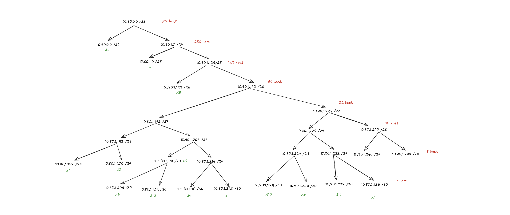

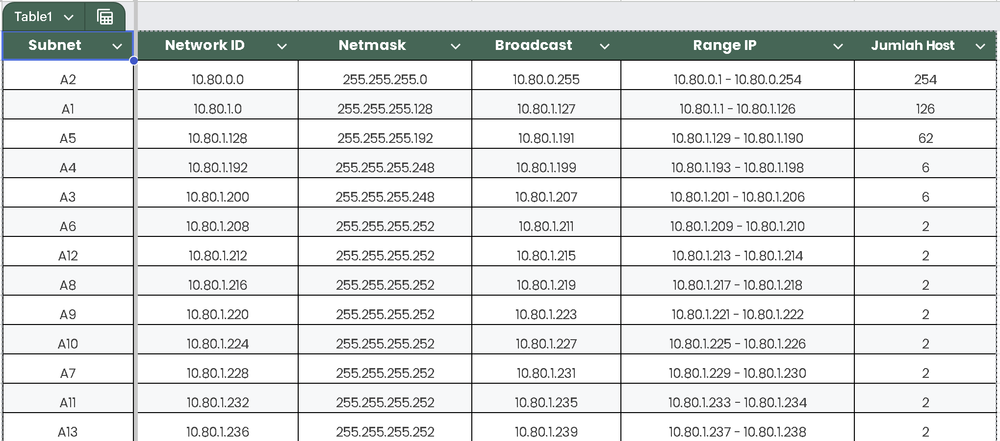

Pembagian Rute
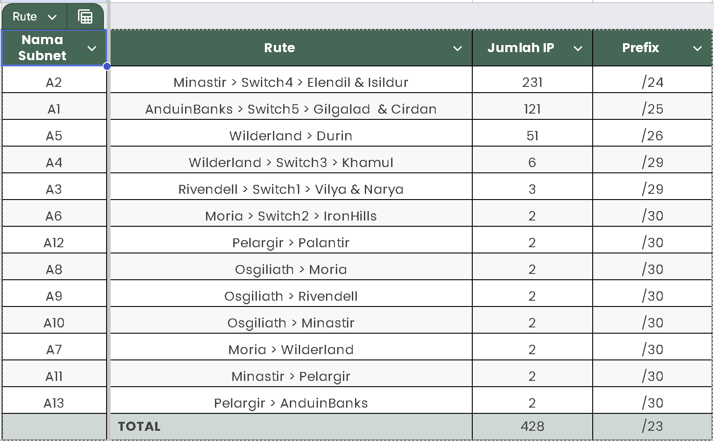

#### 3. Konfigurasi Rute

**1. router.sh**
Script ini adalah skrip gabungan yang berisi konfigurasi infrastruktur untuk 7 Router sekaligus (Osgiliath, Moria, Wilderland, Rivendell, Minastir, Pelargir, dan AnduinBanks).

**Fungsi Rute:**
   * IP Addressing: Mengatur IP statis pada seluruh interface router sesuai skema VLSM High Efficiency (/30).
   * Routing Statis: Mendaftarkan jalur (Next Hop) menuju seluruh subnet client agar paket data bisa tersampaikan dari ujung ke ujung.
   * Default Route: Mengatur jalur default ke arah Osgiliath (Upstream) untuk akses internet.

**Fungsi Internet (Misi 2.1):**
   * Mengaktifkan SNAT (Source NAT) di Osgiliath untuk mengizinkan akses internet tanpa Masquerade .
   * Mengaktifkan ip_forward pada semua router.

#### 4. Konfigurasi Service
Bagian ini berfokus pada instalasi dan konfigurasi aplikasi jaringan (Layer 7) seperti DHCP, DNS, dan Web Server. Script ini dijalankan setelah routing dan internet aktif.

**1. vilya.sh**
* Lokasi: Node Vilya.
* Fungsi:
   * Menginstall isc-dhcp-server.
   * Mengkonfigurasi /etc/dhcp/dhcpd.conf untuk membagikan IP otomatis, Gateway, dan DNS ke subnet Client (A1, A2, A4, A5).

**2. narya.sh**
* Lokasi: Node Narya.
* Fungsi:
   * Menginstall bind9.
   * Mengatur Forwarders ke Google (8.8.8.8) untuk koneksi internet.
   * Membuat Local Zone agar server internal bisa diakses menggunakan nama domain.

**3. palantir.sh**
* Lokasi: Node Palantir (Subnet A12).
* Fungsi:
   * Menginstall apache2.
   * Membuat halaman web kustom "Welcome to Palantir".
   * Mengatur IP statis .214 (/30).

**4. ironhills.sh**
* Lokasi: Node IronHills (Subnet A6).
* Fungsi:
   * Menginstall apache2.
   * Membuat halaman web kustom "Welcome to IronHills".
   * Mengatur IP statis .210 (/30).

**5. minastir.sh**
* Lokasi: Router Minastir.
* Fungsi: Menginstall isc-dhcp-relay untuk meneruskan permintaan IP dari Client Elendil & Isildur ke Vilya.

**6. rivendell.sh**
* Lokasi: Router Rivendell.
* Fungsi: Menginstall isc-dhcp-relay sebagai perantara (Relay) utama yang terhubung langsung ke Vilya.

**7. wilderland.sh**
* Lokasi: Router Wilderland.
* Fungsi: Menginstall isc-dhcp-relay untuk meneruskan permintaan IP dari Client Durin & Khamul.

**8. anduinbanks.sh**
* Lokasi: Router AnduinBanks.
* Fungsi: Menginstall isc-dhcp-relay untuk meneruskan permintaan IP dari Client Gilgalad & Cirdan.

Dokumentasi:

DHCP Relay
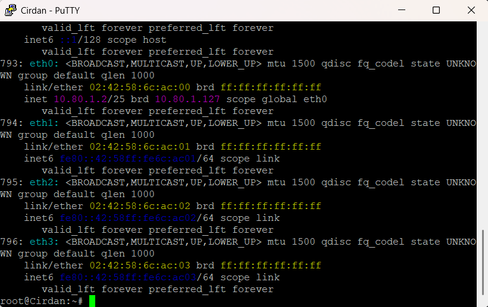

DNS
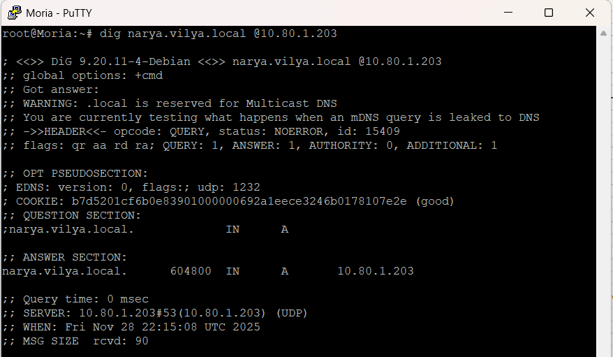

Hostname
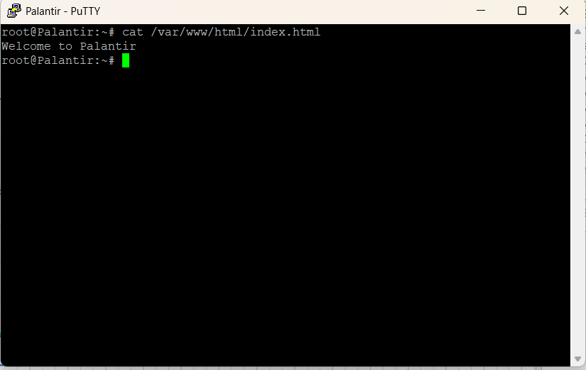

### Misi 2

#### 1. Routing Internet dengan `SNAT`
* File Konfigurasi: router.sh (Pada Osgiliath) 
* Misi: Menghubungkan jaringan Aliansi ke Internet (Valinor) tanpa menggunakan target MASQUERADE.
* Penjelasan: Alih-alih menggunakan MASQUERADE (yang dinamis), kami menggunakan SNAT (Source Network Address Translation) yang statis. Kami mengubah alamat IP sumber paket yang keluar dari interface eth0 menjadi IP Publik Osgiliath (192.168.122.210).

#### 2. Blokir `ICMP` (ping) ke Vilya
* File Konfigurasi: 2-2.sh (Pada Vilya) 
* Misi: Melindungi Vilya (DHCP Server) dari pemindaian ping, namun Vilya tetap bisa melakukan ping ke luar.
* Penjelasan:
   * Kami mengizinkan trafik UDP port 67 (DHCP) dan trafik ESTABLISHED agar fungsi server tetap berjalan.
   * Kami memblokir protokol ICMP pada chain INPUT. Ini membuat Vilya tidak membalas ping dari siapapun.
   * Chain OUTPUT dibiarkan terbuka (ACCEPT), sehingga Vilya tetap bisa mengirim ping ke luar.

Dokumentasi:

Tes Gagal
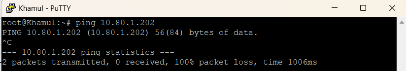

Tes Sukses
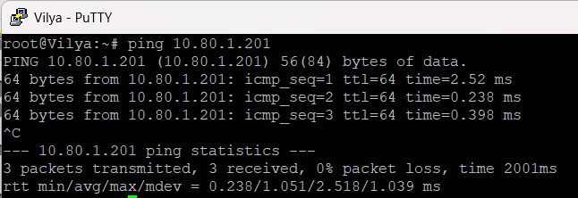

#### 3. Batasi Akses DNS
* File Konfigurasi: 2-3.sh (Pada Narya)
* Misi: Mencegah kebocoran informasi topologi dengan membatasi akses DNS hanya untuk Vilya.
* Penjelasan: Kami menerapkan prinsip Whitelist.
   * Allow Vilya: Mengizinkan paket TCP/UDP pada port 53 HANYA jika Source IP adalah Vilya (10.80.1.202).
   * Allow Localhost: Mengizinkan server mengakses dirinya sendiri.
   * Block All Else: Memblokir akses port 53 dari sumber manapun selain Vilya.

Dokumentasi:

Tes Gagal
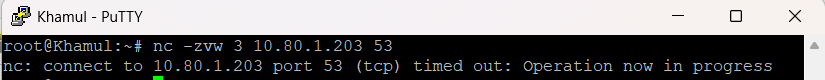

Tes Sukses
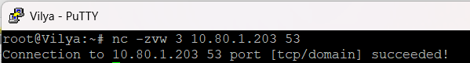

#### 4. Filter Akses Berbasis Waktu
* File Konfigurasi: 2-4.sh (Pada IronHills) 
* Misi: Membatasi akses server IronHills hanya pada hari Sabtu dan Minggu.
* Penjelasan: Kami menggunakan modul -m time dengan parameter --weekdays.
   * Aturan pertama secara eksplisit memblokir (DROP) akses ke port 80 pada hari Senin hingga Jumat (Mon,Tue,Wed,Thu,Fri).
   * Jika hari saat ini adalah Sabtu atau Minggu, paket akan melewati aturan drop tersebut dan diizinkan oleh aturan berikutnya (Accept Faksi).

Dokumentasi Hasil
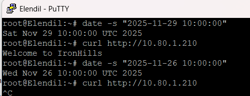

#### 5. Filter Akses Berbasis Jam
* File Konfigurasi: 2-5.sh (Pada Palantir) 
* Misi: Membatasi akses server Palantir berdasarkan jam operasional Ras.
* Penjelasan: Kami menggunakan parameter --timestart dan --timestop untuk menentukan jendela waktu akses.
   * Faksi Elf (A1 - 10.80.1.0/25): Diizinkan pada pukul 07:00 - 15:00.
   * Faksi Manusia (A2 - 10.80.0.0/24): Diizinkan pada pukul 17:00 - 23:00.
   * Semua akses di luar jam dan subnet tersebut akan ditolak oleh aturan Catch-all DROP di akhir script.

Dokumentasi Hasil
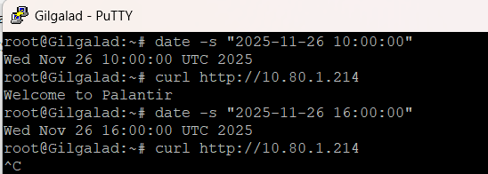

#### 6. Proteksi Port Scanning
* File Konfigurasi: 2-6.sh (Pada Palantir) 
* Misi: Mendeteksi dan memblokir serangan Port Scanning (mencoba mengakses >15 port dalam 20 detik).
* Penjelasan: Kami menggunakan modul -m recent untuk melacak perilaku koneksi.
   * Tracking: Setiap koneksi TCP baru didaftarkan ke daftar bernama portscan.
   * Detection: Jika satu IP tercatat melakukan lebih dari 15 koneksi (--hitcount 15) dalam 20 detik (--seconds 20), paket dilempar ke chain khusus PORTSCAN.
   * Punishment: Di chain PORTSCAN, IP penyerang di-log dengan prefix PORT_SCAN_DETECTED dan di-DROP.
   * Block ICMP: Kami juga mengecek daftar portscan pada protokol ICMP. Jika IP sudah terlanjur di-blacklist karena scan TCP, maka PING dari IP tersebut juga akan diblokir.

Dokumentasi Hasil
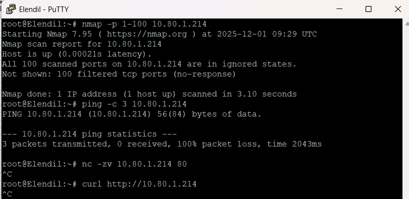

#### 7. Limitasi Koneksi
* File Konfigurasi: 2-7.sh (Pada IronHills) 
* Misi: Mencegah overload dengan membatasi jumlah koneksi aktif.
* Penjelasan: Kami menggunakan modul connlimit untuk menghitung koneksi bersamaan (concurrent).
   * Jika jumlah koneksi dari satu IP melebihi 3 (--connlimit-above 3), paket ke-4 dan seterusnya akan ditolak dengan status REJECT (mengirim sinyal tcp-reset ke pengirim agar koneksi putus seketika).

Dokumentasi Hasil:
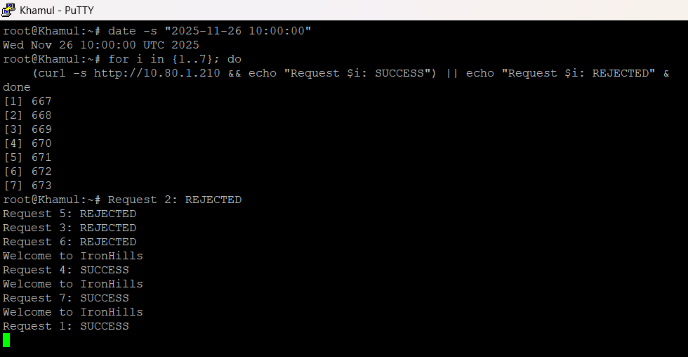

#### 8. Redireksi Traffic
* File Konfigurasi: 2-8.sh 
* Misi: Membelokkan paket dari Vilya yang menuju Khamul ke IronHills.
* Penjelasan: Kami menggunakan DNAT (Destination NAT) pada tabel nat chain PREROUTING.
   * Kondisi: Jika Paket berasal dari Vilya (-s 10.80.1.202) DAN Tujuannya adalah Subnet Khamul (-d 10.80.1.192/29).
   * Aksi: Ubah tujuan paket (--to-destination) menjadi IP IronHills (10.80.1.210).
   * Akibatnya, Vilya merasa mengirim data ke Khamul, namun data tersebut sebenarnya diterima oleh IronHills.

Dokumentasi Hasil:
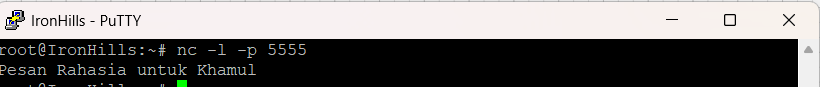

### Misi 3

#### 1. Isolasi Khamul
* File Konfigurasi: 3-1.sh (Pada Router Wilderland) 
* Misi: Memutus total akses jaringan subnet Khamul karena pengkhianatan.
* Penjelasan: Karena Wilderland adalah gateway bagi Khamul, blokir paling efektif dilakukan pada chain FORWARD. Chain ini menangani paket yang lewat melalui router.
   * Block Egress: Memblokir semua paket yang berasal dari (-s) subnet Khamul (10.80.1.192/29).
   * Block Ingress: Memblokir semua paket yang menuju ke (-d) subnet Khamul.
    -   * Kami menggunakan spesifik subnet /29 agar subnet Durin (yang ada di router yang sama) tidak ikut terblokir.

Dokumentasi Hasil
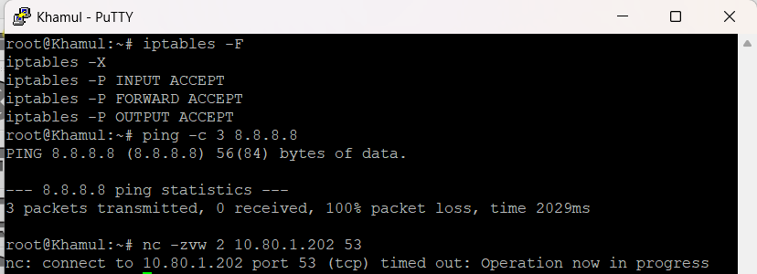
